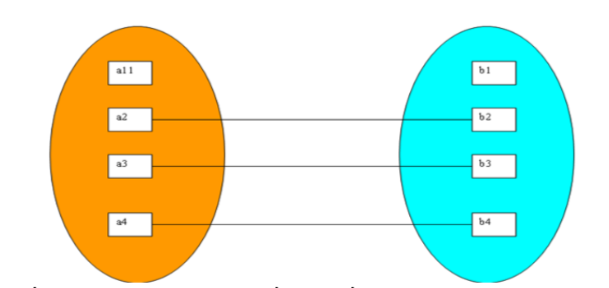
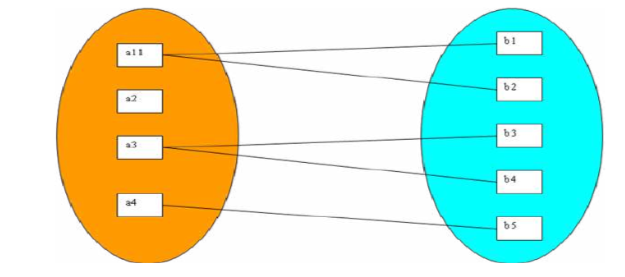
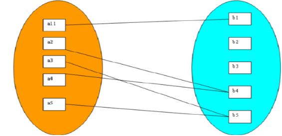
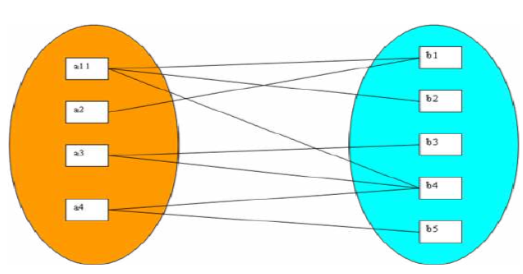
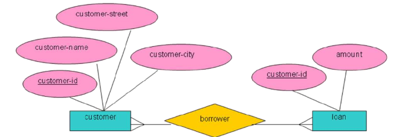

# BUổi 2: CƠ BẢN VỀ THIẾT KẾ CƠ SỞ DỮ LIỆU

## I. Lý thuyết cơ bản về thiết kế cơ sở dữ liệu
### 1. Khái niệm
Thiết kế CSDL (Database Design) là quá trình tạo ra một mô hình dữ liệu chi tiết của một cơ sở dữ liệu. Quá trình này bao gồm việc xác định cấu trúc, lưu trữ và cơ chế truy xuất dữ liệu để đảm bảo dữ liệu đó đáp ứng nhu cầu của người dùng và các ứng dụng sẽ tương tác với nó.

Một CSDL được thiết kế tốt sẽ giúp:
- Duy trì tính nhất quán và toàn vẹn của dữ liệu.
- Tránh trùng lặp dữ liệu.
- Cho phép tìm kiếm nhanh thông qua các chỉ mục phù hợp.
- Đảm bảo bảo mật bằng cách thực thi các ràng buộc.

### 2. Các bước thiết kế cơ sở dữ liệu

Quá trình thiết kế CSDL có thể chia thành 6 bước:

**Bước 1. Phân tích yêu cầu của bài toán:**
Đây là bước đầu tiên trong quá trình thiết kế một ứng dụng cơ sở dữ liệu để có thể hiểu được dữ liệu nào cần được lưu trữ trong cơ sở dữ liệu, ứng dụng nào cần được xây dựng để sử dụng chúng, và các thao tác dữ liệu nào cần được thực hiện thường xuyên và các yêu cầu về tốc độ thực hiện của hệ thống. Đây thường là tiến trình không chính thức liên quan tới những trao đổi với các nhóm người dùng và nghiên cứu môi trường hiện tại. Tiến hành tìm hiểu các ứng dụng hiện có cần được thay thế hoặc bổ trợ cho hệ thống cơ sở dữ liệu. 

**Bước 2. Thiết kế cơ sở dữ liệu mức khái niệm:**
Thông tin được thu thập trong bước phân tích yêu cầu được dùng để phát triển một bản mô tả mức tổng quát các dữ liệu cần được lưu trữ trong cơ sở dữ liệu, cùng với các ràng buộc cần thiết trên những dữ liệu này. 

**Bước 3. Thiết kế cơ sở dữ liệu ở mức logic:** 
Một hệ quản trị cơ sở dữ liệu phải được lựa chọn để cài đặt một cơ sở dữ liệu và để chuyển đôiỉ bản thiết kế cơ sở dữ liệu mức khái niệm sang lược đồ cơ sở dữ liệu với mô hình dữ liệu của hệ quản trị cơ sở dữ liệu đã được lựa chọn.

**Bước 4. Cải thiện các lược đồ:** 
Trong bước nay các lược đồ được phát triển ở bước 3 được phân tích để phát hiện ra các vấn đề tiềm ẩn. Tại bước này, các lược đồ sẽ được chuẩn hóa. Việc chuẩn hóa một cơ sở dữ liệu được dựa trên một lý thuyết toán học rất mạnh và đẹp đẽ. Chúng ta sẽ bàn luận về việc chuẩn hóa này vào những buổi giảng sau. 

**Bước 5. Thiết kế cơ sở dữ liệu vật lý:** 
Tại giai đoạn này, khối lượng công việc tiềm ẩn và các cách thức truy nhập được mô phỏng để xác định những điểm yếu tiềm ẩn trong cơ sở dữ liệu khái niệm. Quá trình này thường là nguyên nhân tạo ra các tệp chỉ mục hoặc/và các quan hệ phân cụm. Trong các tình huống sống còn, toàn bộ mô hình khái niệm sẽ cần được cấu trúc lại. 

**Bước 6.Thiết kế an toàn bảo mật cho hệ thống:** 
Các nhóm người dùng khác nhau được xác định và các vai trò khác nhau của họ được phân tích sao cho cách thức truy nhập tới dữ liệu có thể xác định được.

## II. Lược đồ quan hệ E-R
### 1. Khái niệm
Lược đồ ER (Entity-Relationship Model) là một mô hình khái niệm để thiết kế cơ sở dữ liệu. Mô hình này biểu diễn cấu trúc logic của một cơ sở dữ liệu, bao gồm các thực thể, thuộc tính của chúng và các mối quan hệ giữa chúng.
- Thuộc tính: Các đặc điểm mô tả một thực thể. Ví dụ: StudentID, CourseName hoặc EmployeeEmail.
- Mối quan hệ: Một kết nối giữa các thực thể. Ví dụ: sinh viên đăng ký một khóa học.

### 2. Các thuộc tính (Entity) trong ERD
Như được sử dụng trong mô hình E-R, một thuộc tính có thể được phân chia làm hai loại: 
- Thuộc tính  đơn  hoặc thuộc tính ghép: một thuộc tính đơn không bao  gồm các thành phần cấu thành trong khi các thuộc tính ghép bao gồm các phần con cấu thành.  
Ví dụ, xem xét một thuộc tính tên. Nếu tên biểu diễn một thuộc tính đơn thì chúng ta có thể coi bộ ba cấu thành tên là họ, tên đệm và tên gọi là một thuộc tính nguyên tố, không phân chia được nữa. Mặt khác, nếu coi tên là một thuộc tính ghép thì chúng ta có lựa chọn thao tác với thuộc tính này là một tên đầy đủ hoặc có thể thao tác với từng thành phần cấu thành của tên. Ví dụ, chúng ta có thể chỉ thao tác với tên họ, cái mà không thể thực hiện với một thuộc tính đơn.

- Thuộc tính đơn trị hoặc đa trị:
    - Thuộc tính đơn trị: Chỉ nhận tối đa một giá trị tại một thời điểm xác định. Ví dụ: Số lượng sinh viên đăng ký của một lớp học (tại một thời điểm chỉ có thể là 100, không thể đồng thời là 100, 80 và 45).
    - Thuộc tính đa trị: Có thể nhận nhiều giá trị cùng một lúc cho một thực thể. Có thể thiết lập cận trên và cận dưới cho số lượng giá trị được phép lưu trữ. Ví dụ: Số điện thoại của sinh viên (một người có thể dùng 2–3 số điện thoại cùng lúc).

- Thuộc tính phái sinh: Giá trị không được lưu trực tiếp mà được suy ra (tính toán) từ các thuộc tính hoặc thực thể liên quan khác. Ví dụ: Thuộc tính loans-held (số khoản vay) của khách hàng - được xác định bằng cách đếm tổng số thực thể khoản vay liên kết với khách hàng đó.

- Thuộc tính rỗng: Xuất hiện khi một thực thể không có giá trị tại thuộc tính đó. Ví du: người chưa đi làm thì không có mã số thuế.

### 3. Các mối quan hệ (Relationship) trong ERD

Một mối quan hệ hay liên kết là một sự liên hệ giữa một vài thực thể.  

Ví dụ chúng ta có thể định nghĩa một mối liên kết thể hiện bạn là một sinh viên của một lớp học nào đó. Mối quan hệ này xác nhận rằng bạn đã đăng ký học lớp đó.  

Về mặt hình thức, một mối quan hệ là một tập các quan hệ cùng loại. Nó là một quan hệ toán học của n tập thực thể (có thể giao nhau, n >= 2).  

Với một tập quan hệ hai ngôi R giữa tập thực thể A và B, ánh xạ lực lượng sẽ rơi vào một trong các loại sau:  
- Liên kết (1:1): một tới một từ A đến B  

- Liên kết (1:N) hay (1:M): một tới nhiều từ A đến B  

- Liên kết (N:1) hay (M:1): nhiều tới một từ A đến B.  

- Liên kết (N:N) hay (M:M) hay (N:M): nhiều tới nhiều từ A đến B  



### 4. Các ký hiệu dùng trong lược đồ ER
Mô hình ER được sử dụng để mô hình hóa quan điểm logic của hệ thống từ góc độ dữ liệu, bao gồm các ký hiệu sau:

| Hình vẽ | Ký hiệu | Ý nghĩa |
| :--- | :---: | :--- |
| Hình chữ nhật | ▭ | Thực thể trong Mô hình ER |
| Hình elip | ⬭ | Thuộc tính trong Mô hình ER |
| Hình thoi | ◇ | Mối quan hệ giữa các Thực thể |
| Đường thẳng | ── | Thuộc tính kết nối với Thực thể và Tập thực thể với các Loại quan hệ khác |
| Hình elip kép | ⦾ | Thuộc tính đa trị |
| Hình chữ nhật kép | hai hình chữ nhật đồng tâm | Thực thể yếu |

Ví dụ về lược đồ E-R:  


## III. Mô hình dữ liệu quan hệ
### 1. Giới thiệu
- Cung cấp một cấu trúc dữ liệu đơn giản và đồng bộ
- Dữ liệu được tổ chức dưới dạng quan hệ
- Mỗi quan hệ là một bảng hai chiều gồm các cột và các dòng dùng đểmô tả thực thể.Mỗi cột tương ứng với một thuộc tính của thực thể.Mỗidòng là một bộ các giá trị dữ liệu của một đối tượng cụ thể thuộc thực thể.

### 2. Các khái niệm
- Quan hệ (Relation): Có thể hiểu đơn giản, một quan hệ là một bảng dữ liệu gồm một số cột và một số dòng dữ liệu. Ký hiệu: r, s, q...  

Ví dụ Quan hệ nhân viên:  
| MÃ NHÂN VIÊN | HỌ TÊN | NTNS | ĐIỆN THOẠI | ĐỊA CHỈ |
| :--- | :--- | :--- | :--- | :--- |
| N001 | Trần Minh Anh | 5/9/1989 | 098998899 | 12 bis Ngô Gia Tự, Q. 10 |
| N002 | Lê Quốc Đại | 23/10/1990 | 093232323 | 56A/189 Lê Thánh Tôn, Q.1 |
| N003 | Nguyễn Ngọc Lan | 3/9/1987 | 091121212 | Lầu 3 lô C chung cư Bình Giã, Q.5 |
| N004 | Mai Thúy Ngọc | 16/8/1991 | 090234567 | 256/17C Hoàng Văn Thụ, Q. Tân Bình |  

- Thuộc tính (Attribute): Là các cột của quan hệ,mô tả ý nghĩa cho giá trị của các cột đó. Mỗi thuộc tính đặc trưng bởi một tên gọi,kiểu dữ liệu và miền giá trị. Ký hiệu của thuộc tính: thuộc tính thứ i: Ai.  

Vd: Quan hệ NHÂN VIÊN có các thuộc tính gồm: Mã Nhân Viên, Họ Tên, NTNS, Điện Thoại, Địa chỉ.   

- Bộ (Tuple): Là các dòng của quan hệ. Trong đó, thứ tự các bộ trong quan hệ không quan trọng và không có 2 bộ trùng nhau trong 1 quan hệ. Ký hiệu của bộ: v, t, u...

Ví dụ:
<N001, Trần Minh Anh, 5/9/1989, 098998899, 12 bis Ngô Gia Tự, Q.10> là một bộ của quan hệ NHÂN VIÊN.  


- Lược đồ quan hệ (Relation Schema): Mô tả cấu trúc của quan hệ, bao gồm tên lược đồ và tập thuộc tính. Ký hiệu là R, S, Q... Trong đó, lược đồ quan hệ R bậc n có dạng R(A1, A2, …, An), và một quan hệ r của lược đồ quan hệ R(A1, A2, …, An) được ký hiệu là r(R). Khi thành lập một lược đồ quan hệ, người thiết kế luôn gắn cho nó một ý nghĩa nhất định gọi là mô tả (tân từ) của lược đồ quan hệ đó.

- Khóa và Định danh thực thể: Trong cơ sở dữ liệu, các thực thể trong cùng một tập hợp bắt buộc phải có sự khác biệt thông qua dữ liệu thuộc tính của chúng (không tồn tại tình trạng hai thực thể giống hệt nhau ở mọi thuộc tính). Khóa đóng vai trò là tập thuộc tính tối thiểu giúp phân biệt rạch ròi từng thực thể cũng như xác lập định danh cho các mối liên kết giữa chúng.

- Khóa chính (Primary Key - PK): Đóng vai trò là mã định danh đại diện cho từng bản ghi trong bảng. Để bảo đảm tính toàn vẹn thực thể, giá trị khóa chính bắt buộc phải duy nhất và không được phép để trống (NOT NULL).

- Khóa ngoại (Foreign Key - FK): Là trường dữ liệu dùng để liên kết sang khóa chính của bảng khác, giữ nhiệm vụ duy trì tính toàn vẹn tham chiếu giữa các thực thể liên quan.

| Tiêu chí | Khóa chính (PK) | Khóa ngoại (FK) |
| :--- | :--- | :--- |
| Mục đích chính | Phân biệt duy nhất từng bản ghi trong nội bộ bảng | Tạo mối liên kết dữ liệu sang một bảng khác |
| Tính độc nhất | Bắt buộc duy nhất, không trùng lặp | Được phép trùng lặp (để biểu diễn quan hệ 1 - N) |
| Chấp nhận NULL | Không (luôn NOT NULL để định danh) | Có thể nhận NULL (tùy thuộc vào quy tắc nghiệp vụ) |
| Số lượng trong 1 bảng | Tối đa 1 khóa chính | Có thể có nhiều khóa ngoại |


## IV. Chuẩn hóa dữ liệu: 1NF, 2NF, 3NF
### 1. Giới thiệu
- Khái niệm: Chuẩn hóa cơ sở dữ liệu (Database Normalization) là quá trình tổ chức lại các bảng và thuộc tính trong cơ sở dữ liệu nhằm giảm thiểu dư thừa dữ liệu (data redundancy), tránh các bất thường khi thêm/sửa/xóa (anomalies), đảm bảo tính toàn vẹn dữ liệu (data integrity), đồng thời tối ưu hóa không gian lưu trữ và hiệu năng truy vấn.

- Lý do cần Normalization: Trong các hệ thống thực tế (như website thương mại điện tử), việc lưu trữ toàn bộ dữ liệu vào một file đơn lẻ (như JSON) bộc lộ nhiều hạn chế khi mở rộng hệ thống. Cơ sở dữ liệu chuẩn hóa giải quyết các vấn đề sau:
  - Quy mô dữ liệu: Xử lý hiệu quả khi khối lượng bản ghi lên tới hàng triệu dòng.
  - Khả năng truy vấn: Hỗ trợ tìm kiếm, lọc và kết xuất các tập dữ liệu phức tạp nhanh chóng.
  - Tính đồng bộ: Đảm bảo kiểm soát tranh chấp khi nhiều người dùng thao tác cùng một thời điểm.
  - An toàn và phân quyền: Thiết lập cơ chế bảo mật và phân quyền truy cập chi tiết cho từng đối tượng dữ liệu.

### 2. Chuẩn 1NF
Một bảng đạt dạng chuẩn 1 khi và chỉ khi thỏa mãn các điều kiện:
  - Mỗi ô chỉ chứa một giá trị nguyên tố duy nhất (Atomic values), không chứa danh sách hay tập hợp dữ liệu.
  - Không tồn tại nhóm lặp lại (Repeating groups).
  - Có khóa chính (Primary Key) xác định duy nhất cho từng bản ghi.  

Dấu hiệu nhận biết vi phạm 1NF:
  - Dữ liệu chứa dấu phẩy hoặc ký tự phân tách để gộp nhiều giá trị (ví dụ: "Math, Physics, Chemistry").
  - Lưu trữ cột dạng mảng (Array) hoặc JSON trong cơ sở dữ liệu quan hệ khi không cần thiết.
  - Phải dùng hàm tách chuỗi (parse/split string) để lấy từng giá trị đơn lẻ.
  - Khó khăn và giảm hiệu năng khi viết câu truy vấn lọc, tìm kiếm theo từng phần tử bên trong ô dữ liệu.  

Ví dụ vi phạm 1NF:
Cột `subjects` chứa nhiều môn học trong cùng một ô, vi phạm tính nguyên tố (Atomic).

```sql
CREATE TABLE students (
    id INT PRIMARY KEY,
    name VARCHAR(100),
    subjects VARCHAR(200) -- Chứa chuỗi "Math, Physics, Chemistry"
);
```

Cách chuẩn hóa đạt 1NF:
Tách thuộc tính đa trị thành một bảng quan hệ riêng biệt kết nối qua khóa ngoại.  
```sql
CREATE TABLE students (
    id INT PRIMARY KEY,
    name VARCHAR(100)
);

CREATE TABLE student_subjects (
    student_id INT,
    subject VARCHAR(50),
    PRIMARY KEY (student_id, subject),
    FOREIGN KEY (student_id) REFERENCES students(id)
);
```

### 3. Chuẩn 2NF
Chuẩn 2NF (Second Normal Form): Một bảng đạt dạng chuẩn 2 khi và chỉ khi:
  - Đã đạt chuẩn 1NF.
  - Không tồn tại phụ thuộc hàm bộ phận (No Partial Dependency), nghĩa là mọi thuộc tính không khóa phải phụ thuộc hàm đầy đủ vào toàn bộ khóa chính.  

Lưu ý:
  - Chuẩn 2NF chỉ áp dụng cho các bảng có khóa chính tổng hợp (Composite Primary Key gồm từ 2 cột trở lên).
  - Nếu khóa chính chỉ gồm 1 cột đơn lẻ, bảng đã đạt 1NF thì mặc định đạt chuẩn 2NF.  

| Dấu hiệu | Mô tả | Ví dụ |
| :--- | :--- | :--- |
| **Composite Primary Key** | Khóa chính có từ 2 cột trở lên | `{order_id, product_id}` |
| **Lặp dữ liệu không cần thiết** | Cùng một thông tin lặp lại ở nhiều bản ghi | "iPhone 15" lặp lại trên nhiều `order_id` khác nhau |
| **Bỏ bớt một phần khóa** | Vẫn xác định được giá trị của cột không khóa | Chỉ cần biết `product_id` đã suy ra được `product_name` |
| **Thuộc về thực thể khác** | Cột mang thông tin của một thực thể tách biệt | `product_name`, `product_price` thuộc thực thể "Sản phẩm" |

Ví dụ vi phạm 2NF:
Bảng có khóa chính `{order_id, product_id}`, nhưng `product_name` và `product_price` chỉ phụ thuộc vào `product_id`.

```sql
CREATE TABLE order_details (
    order_id INT,
    product_id INT,
    product_name VARCHAR(100),    Vi phạm: chỉ phụ thuộc vào product_id
    product_price DECIMAL(10,2),  Vi phạm: chỉ phụ thuộc vào product_id
    quantity INT,                 Phụ thuộc cả {order_id, product_id}
    line_total DECIMAL(10,2),     Phụ thuộc cả {order_id, product_id}
    
    PRIMARY KEY (order_id, product_id)
);
```

Cách chuẩn hóa đạt 2NF:
Tách các thuộc tính bị phụ thuộc bộ phận thành bảng thực thể riêng biệt.

### 4. Chuẩn 3NF
Chuẩn 3NF (Third Normal Form): Một bảng đạt dạng chuẩn 3 khi và chỉ khi:
  - Đã đạt chuẩn 2NF.
  - Không tồn tại phụ thuộc bắc cầu (No Transitive Dependency), nghĩa là không có thuộc tính không khóa nào phụ thuộc vào khóa chính thông qua một thuộc tính không khóa khác (chuỗi phụ thuộc: A -> B -> C).

Dấu hiệu nhận biết vi phạm 3NF:
  - Tồn tại chuỗi phụ thuộc gián tiếp: Cột A xác định cột B, và cột B lại xác định cột C (trong đó B không phải là khóa chính hay siêu khóa).
  - Lặp dữ liệu theo nhóm: Dữ liệu của một nhóm thuộc tính (như thông tin phòng ban) bị lặp lại ở nhiều bản ghi nhân viên cùng phòng ban.
  - Thuộc tính không đúng thực thể: Xuất hiện các cột không trực tiếp mô tả thực thể chính của bảng.
  - Bất thường khi cập nhật (Update Anomaly): Khi cần sửa đổi thông tin của một đối tượng phụ (như đổi tên phòng ban), hệ thống phải cập nhật trên nhiều dòng dữ liệu khác nhau.

Ví dụ vi phạm 3NF:
Bảng có khóa chính `id`, nhưng các thông tin `department_name`, `department_location`, `department_budget` lại phụ thuộc gián tiếp vào `id` thông qua `department_id`.

```sql
CREATE TABLE employees (
    id INT PRIMARY KEY,
    name VARCHAR(100),
    email VARCHAR(100),
    department_id INT,
    department_name VARCHAR(100),     Vi phạm: id -> department_id -> department_name
    department_location VARCHAR(100),  Vi phạm: id -> department_id -> department_location
    department_budget DECIMAL(12,2),  Vi phạm: id -> department_id -> department_budget
    salary DECIMAL(10,2)
);
```

Cách chuẩn hóa đạt 3NF:  
Tách các thuộc tính phụ thuộc bắc cầu thành một bảng riêng biệt và sử dụng khóa ngoại để liên kết.

```sql
CREATE TABLE departments (
    id INT PRIMARY KEY,
    name VARCHAR(100) NOT NULL,
    location VARCHAR(100),
    budget DECIMAL(12,2),
    manager_id INT,
    FOREIGN KEY (manager_id) REFERENCES employees(id)
);

CREATE TABLE employees (
    id INT PRIMARY KEY,
    name VARCHAR(100) NOT NULL,
    email VARCHAR(100) UNIQUE NOT NULL,
    department_id INT NOT NULL,
    salary DECIMAL(10,2),
    hire_date DATE,
    FOREIGN KEY (department_id) REFERENCES departments(id)
);
```