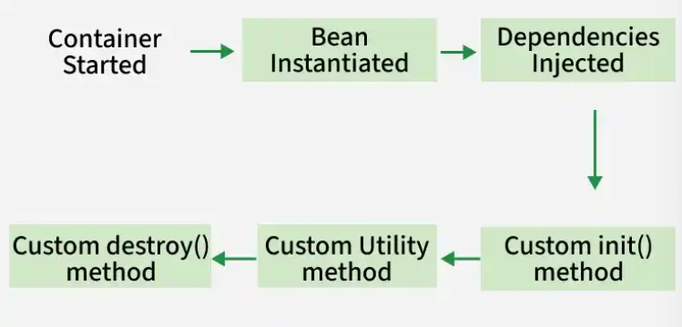

# BUỔI 6: SPRING MVC

- [BUỔI 6: SPRING MVC](#buổi-6-spring-mvc)
  - [1. Bean](#1-bean)
    - [1.1 Định nghĩa](#11-định-nghĩa)
    - [1.2 Đặc điểm chính của Bean](#12-đặc-điểm-chính-của-bean)
    - [1.3 Defining Beans in Spring](#13-defining-beans-in-spring)
      - [1.3.1 XML-Based Configuration](#131-xml-based-configuration)
      - [1.3.2 Annotation-Based Configuration](#132-annotation-based-configuration)
      - [1.3.3 Java-Based Configuration](#133-java-based-configuration)
    - [1.4 Bean Factory](#14-bean-factory)
    - [1.5 Bean Scopes - Phạm vi Bean](#15-bean-scopes---phạm-vi-bean)
    - [1.6 Dependency Injection với Beans](#16-dependency-injection-với-beans)
    - [1.6 Vòng đời của Bean](#16-vòng-đời-của-bean)
      - [Khởi tạo Container](#khởi-tạo-container)
      - [Khởi tạo Bean](#khởi-tạo-bean)
      - [Dependency Injection](#dependency-injection)
      - [Phương thức khởi tạo tùy chỉnh](#phương-thức-khởi-tạo-tùy-chỉnh)
      - [Bean sẵn sàng sử dụng](#bean-sẵn-sàng-sử-dụng)
      - [Hủy Bean](#hủy-bean)
  - [2. Spring MVC: @Controller, Thymeleaf](#2-spring-mvc-controller-thymeleaf)
    - [2.1 @Controller](#21-controller)
    - [2.2 @Thymeleaf](#22-thymeleaf)
  - [3. Annotation](#3-annotation)
    - [Nhóm Khởi tạo và Cấu hình Core](#nhóm-khởi-tạo-và-cấu-hình-core)
    - [Nhóm Tiêm phụ thuộc Dependency Injection](#nhóm-tiêm-phụ-thuộc-dependency-injection)
    - [Nhóm Xử lý API Request Mapping](#nhóm-xử-lý-api-request-mapping)
  - [5. Log](#5-log)
    - [5.1. Các cấp độ Log (Log Levels)](#51-các-cấp-độ-log-log-levels)
    - [5.2. Cấu hình nhanh trong `application.properties`](#52-cấu-hình-nhanh-trong-applicationproperties)
      - [Thay đổi cấp độ Log](#thay-đổi-cấp-độ-log)
      - [Ghi Log ra file](#ghi-log-ra-file)


## 1. Bean
### 1.1 Định nghĩa
Bean là một đối tượng được khởi tạo, cấu hình, và quản lý bởi Spring IoC container. Beans là các khối chính của một ứng 
dụng Spring. Chúng được định nghĩa thông qua cấu hình XML, annotations hoặc cấu hình dựa trên Java. Container có trách 
nhiệm quản lý vòng đời của các bean này, bao gồm việc khởi tạo, cấu hình và hủy chúng.  

When you annotate a class with @Component, @Service, @Repository, or @Controller, Spring automatically registers it as a
Bean in the application context. You can also define beans manually using the @Bean annotation in a configuration class.  

```java
public class Engine {
    public void run() {
        System.out.println("Engine is running...");
    }
}
```
->In this example, Engine is a Bean, and Spring will manage its lifecycle and make it available for injection wherever needed.
### 1.2 Đặc điểm chính của Bean
- Singleton by Default: Theo mặc định, các Spring bean là singleton, có nghĩa là chỉ một phiên bản của bean được tạo 
trên mỗi vùng chứa Spring IoC. Phiên bản này được chia sẻ trên toàn bộ ứng dụng.
- Configurable: Các bean có thể được tùy chỉnh và cấu hình thông qua XML, annotation hoặc mã Java.
- Managed by the Container: Toàn bộ vòng đời của một bean từ lúc khởi tạo đến khi bị hủy được quản lý bởi Spring IoC Container.

### 1.3 Defining Beans in Spring
Có 3 cách chính để configure Bean trong Spring

#### 1.3.1 XML-Based Configuration
Note: An XML file is a plain-text document that uses custom tags to organize, store, and transport structured data.
XML stands for eXtensible Markup Language. Unlike HTML, which focuses on how a web page looks, XML focuses entirely on 
what the data is and how it is structured. An XML file is used to store, structure, and transport data in a plain-text 
format that both humans and computers can easily read.

Các bean được định nghĩa trong một tệp XML (thường có tên là applicationContext.xml). Mỗi bean được thể hiện bằng một thẻ 
<bean>, nơi ta có thể chỉ định lớp, thuộc tính và các phụ thuộc của bean.

```xml
<bean id="myBean" class="com.example.MyClass">
    <property name="propertyName" value="propertyValue"/>
</bean>
```

-> This block is the foundation of Dependency Injection (DI) and Inversion of Control (IoC). Instead of manually writing 
Java code to create objects (e.g., MyClass myBean = new MyClass(); myBean.setPropertyName("propertyValue");), you let the 
Spring Framework handle the creation and setup automatically based on this XML file.  

#### 1.3.2 Annotation-Based Configuration
Spring cho phép định nghĩa các bean bằng cách sử dụng chú thích (annotation) trực tiếp trong các lớp Java. C
hú thích phổ biến nhất cho mục đích này là @Component, đánh dấu một lớp là một Spring bean.  
```java
@Component
public class MyClass {
    // Class implementation
}
```  
Để có thể quét component, tự động phát hiện và đăng ký các bean được chú thích bằng @Component, ta cần thêm chú thích 
@ComponentScan vào lớp cấu hình của mình.  
```java
@Configuration
@ComponentScan(basePackages = "com.example")
public class AppConfig {
    // Configuration code
}
```

#### 1.3.3 Java-Based Configuration
Các bean được định nghĩa bằng cách sử dụng các phương thức @Bean bên trong một lớp @Configuration. Đây là cách an toàn để 
định nghĩa các bean và thường được sử dụng trong các ứng dụng Spring.  

```java
@Configuration
public class AppConfig {

    @Bean
    public MyClass myBean() {
        return new MyClass();
    }
}
```
### 1.4 Bean Factory

Spring BeanFactory là container đơn giản nhất trong Spring Framework, có nhiệm vụ quản lý quá trình tạo và vòng đời của Bean thông qua Dependency Injection. BeanFactory tải các định nghĩa Bean và Dependency của chúng tại thời điểm chạy dựa trên metadata cấu hình. BeanFactory đóng vai trò là IoC Container cơ bản, trong khi ApplicationContext mở rộng interface BeanFactory và cung cấp thêm các tính năng dành cho ứng dụng doanh nghiệp.

- Khởi tạo, cấu hình và quản lý Bean bằng cấu hình XML hoặc Java.
- Hỗ trợ cơ chế Lazy Loading cho Bean, chỉ tạo Bean khi Bean được yêu cầu.
- Không hỗ trợ các tính năng nâng cao như cấu hình dựa trên Annotation, không giống ApplicationContext.

### 1.5 Bean Scopes - Phạm vi Bean
Spring cung cấp một số phạm vi để xác định vòng đời của một bean:
- Singleton (mặc định): Có 1 biến/Spring IoC container.
- Prototype: Một phiên bản mới được khởi tạo mỗi lần bean được yêu cầu.
- Request: Một phiên bản mới được khởi tạo cho mỗi HTTP request. Phạm vi này đuược dùng trong web applications.
- Session: MỘt phiên bản mới được khởi tạo cho mỗi session HTTP.
- Global Session: Một phiên bản mới được tạo 
### 1.6 Dependency Injection với Beans
Spring Boot quét ứng dụng để tìm các thành phần và tự động kết nối chúng với nhau. Khi một lớp yêu cầu một phần phụ thuộc, 
nó có thể được tiêm vào lớp đó từ nhóm các Bean.  

```java
@Component
public class Car {
    private final Engine engine;

    @Autowired // Automatically inject the Engine bean
    public Car(Engine engine) {
        this.engine = engine;
    }

    public void start() {
        engine.run();
    }
}
```  
-> Tại đây, Spring Boot tự động tiêm Engine Bean vào hàm tạo Car khi nó tạo đối tượng Car.  


### 1.6 Vòng đời của Bean
The Bean Life Cycle in Spring describes the sequence of steps a bean goes through, from its creation and initialization 
to its destruction.  
  

#### Khởi tạo Container

- Spring IoC Container được khởi động và tải metadata cấu hình từ XML, annotation hoặc Java config.
- Các định nghĩa Bean được đăng ký và các thành phần cơ sở hạ tầng như các Processor được chuẩn bị.

#### Khởi tạo Bean

- Container tạo đối tượng Bean thông qua Constructor hoặc Factory Method.
- Ở giai đoạn này, Bean đã tồn tại trong bộ nhớ nhưng các Dependency chưa được tiêm vào.

#### Dependency Injection

- Container tìm và xác định các Dependency cần thiết từ IoC Container.
- Dependency được tiêm thông qua Constructor, Setter hoặc Field.

#### Phương thức khởi tạo tùy chỉnh

- Phương thức init() tùy chỉnh được gọi sau khi tất cả Dependency đã được tiêm.
- Được sử dụng để thực hiện các thiết lập bổ sung như khởi tạo tài nguyên, kiểm tra các thuộc tính hoặc khởi tạo kết nối.

#### Bean sẵn sàng sử dụng

- Bean đã được khởi tạo hoàn chỉnh.
- Các phương thức nghiệp vụ được ứng dụng gọi.

#### Hủy Bean

- Logic dọn dẹp được thực hiện thông qua @PreDestroy, destroy() hoặc các phương thức destroy tùy chỉnh.
- Các tài nguyên như kết nối cơ sở dữ liệu hoặc luồng được giải phóng trước khi Bean bị loại bỏ.

## 2. Spring MVC: @Controller, Thymeleaf
Spring MVC là một framework thuộc hệ sinh thái Spring, được thiết kế dựa trên mô hình MVC Model - View - Controller để hỗ trợ xây dựng các ứng dụng web và RESTful API một cách nhanh chóng và linh hoạt.

Mô hình này hoạt động dựa trên 3 thành phần chính:

- **Model Mô hình:** Chứa dữ liệu của ứng dụng và các logic nghiệp vụ.
- **View Giao diện:** Thành phần hiển thị dữ liệu cho người dùng, thường là các file HTML, JSP hoặc JSON/XML đối với API.
- **Controller Bộ điều khiển:** Tiếp nhận các yêu cầu request từ người dùng, gọi thành phần Model để xử lý, sau đó lựa chọn thành phần View phù hợp để hiển thị kết quả.

### 2.1 @Controller

`@Controller` là một Annotation trong Spring Framework được sử dụng để đánh dấu một class đóng vai trò là Controller trong mô hình MVC Model - View - Controller.

Các đặc điểm và nhiệm vụ chính:

- **Tiếp nhận Request:** Tiếp nhận các yêu cầu HTTP từ người dùng gửi đến ứng dụng.
- **Xử lý Logic:** Gọi các lớp Service để xử lý dữ liệu hoặc thực hiện logic nghiệp vụ.
- **Trả về View:** Sau khi xử lý, Controller thường trả về tên của một giao diện như file HTML, JSP hoặc Thymeleaf để hiển thị kết quả cho người dùng.
- **Tự động khởi tạo:** Khi ứng dụng chạy, Spring Container sẽ tự động phát hiện, khởi tạo và quản lý class này dưới dạng một Spring Bean.

### 2.2 @Thymeleaf
**Thymeleaf** là một Java Template Engine, được sử dụng phổ biến trong các ứng dụng web, đặc biệt là Spring Boot, để xử lý và hiển thị dữ liệu từ server lên giao diện người dùng UI.

Các đặc điểm của Thymeleaf:

- **Tích hợp Spring Boot:** Là Template Engine được sử dụng phổ biến trong Spring Boot và được khuyến khích sử dụng thay thế cho JSP.
- **Natural Templates:** Các file Thymeleaf có phần mở rộng là `.html`. Có thể mở và xem giao diện trực tiếp trên trình duyệt như một file HTML tĩnh thông thường mà không cần chạy server.
- **Cú pháp rõ ràng:** Sử dụng các thuộc tính HTML tùy chỉnh bắt đầu bằng tiền tố `th:`, ví dụ `th:text`, `th:each`, `th:if`, để nhúng logic và dữ liệu động vào trang web một cách rõ ràng.
## 3. Annotation
Annoation là một dạng siêu dữ liệu (metadata) bắt đầu bằng ký tự @, dùng để gắn nhãn lên các class, phương thức hoặc biến nhằm hướng dẫn framework Spring thực hiện các hành động tự động mà không cần viết file cấu hình XML phức tạp.  

### Nhóm Khởi tạo và Cấu hình Core

- **`@SpringBootApplication`**: Được đặt ở class Main để khởi chạy ứng dụng. Đây là annotation kết hợp của 3 annotation:
    - **`@Configuration`**: Đánh dấu class chứa các cấu hình của ứng dụng.
    - **`@EnableAutoConfiguration`**: Cho phép Spring Boot tự động cấu hình ứng dụng dựa trên các dependency có trong project.
    - **`@ComponentScan`**: Quét các package để tìm và đăng ký các Spring Bean.

- **`@Bean`**: Được đặt trên method trong class cấu hình để tạo một Object và đưa Object đó vào Spring Container quản lý. Thường được sử dụng khi cần tích hợp các thư viện bên thứ ba hoặc khi muốn tự cấu hình một Bean.

###Nhóm Định danh Bean Stereotype

Các annotation trong nhóm này được sử dụng để đánh dấu các class để Spring Boot tự động phát hiện và quản lý dưới dạng Spring Bean.

| Annotation | Tầng áp dụng Layer | Chức năng chính |
|---|---|---|
| **`@Component`** | Chung Generic | Đánh dấu một class thông thường là một Spring Bean. |
| **`@Controller`** | Controller Giao diện | Xử lý các request từ client và trả về View như HTML hoặc Thymeleaf. |
| **`@RestController`** | Controller API | Kết hợp `@Controller` và `@ResponseBody`. Được sử dụng để xây dựng RESTful API, dữ liệu trả về trực tiếp dưới dạng JSON hoặc XML thay vì trả về giao diện. |
| **`@Service`** | Service Logic | Chứa các logic xử lý nghiệp vụ Business Logic của ứng dụng. |
| **`@Repository`** | Repository Dữ liệu | Làm việc với cơ sở dữ liệu, đảm nhận việc giao tiếp và truy vấn dữ liệu. |


### Nhóm Tiêm phụ thuộc Dependency Injection


- **`@Autowired`**: Tự động tìm kiếm Bean phù hợp trong Spring Container và tiêm Bean đó vào vị trí được khai báo. Có thể sử dụng với thuộc tính, Setter hoặc Constructor.

- **`@Qualifier`**: Được sử dụng kết hợp với `@Autowired` khi có nhiều Bean cùng kiểu dữ liệu. Annotation này giúp chỉ định chính xác Bean cần được tiêm.


### Nhóm Xử lý API Request Mapping

- **`@RequestMapping`**: Định nghĩa đường dẫn URL cho một class hoặc method.

- **`@GetMapping`**: Xử lý các HTTP GET request.

- **`@PostMapping`**: Xử lý các HTTP POST request.

- **`@PutMapping`**: Xử lý các HTTP PUT request.

- **`@DeleteMapping`**: Xử lý các HTTP DELETE request.

- **`@PathVariable`**: Lấy giá trị biến trực tiếp từ đường dẫn URL.

  Ví dụ:

  ```text
  /users/{id}
  
## 4. Lombok

**Lombok** là một thư viện Java giúp tự động sinh mã nguồn mẫu như getter, setter, constructor và `toString()` trong quá trình biên dịch. Lombok giúp giảm lượng mã nguồn cần viết thủ công và làm cho mã nguồn Spring Boot ngắn gọn hơn.

### Các Annotation phổ biến

- **`@Getter` / `@Setter`**: Tự động sinh các phương thức getter và setter cho các thuộc tính.
- **`@NoArgsConstructor`**: Tạo constructor không có tham số.
- **`@AllArgsConstructor`**: Tạo constructor có đầy đủ các tham số tương ứng với các thuộc tính.
- **`@ToString`**: Tự động sinh phương thức `toString()`.
- **`@EqualsAndHashCode`**: Tự động sinh các phương thức `equals()` và `hashCode()`.
- **`@Data`**: Kết hợp `@Getter`, `@Setter`, `@ToString`, `@EqualsAndHashCode` và `@RequiredArgsConstructor`.
- **`@Builder`**: Cung cấp Builder Pattern để hỗ trợ khởi tạo Object một cách thuận tiện.

### Cách sử dụng nhanh trong Spring Boot

**Thêm dependency vào `pom.xml`**

Nếu sử dụng Maven:

```xml
<dependency>
    <groupId>org.projectlombok</groupId>
    <artifactId>lombok</artifactId>
    <optional>true</optional>
</dependency>
```

Nếu sử dụng Gradle, thêm dependency Lombok tương ứng vào file build.gradle.

**Cài đặt plugin Lombok trên IDE**

Cài đặt plugin Lombok trên IDE như IntelliJ IDEA hoặc Eclipse để IDE nhận diện các phương thức được Lombok tự động sinh 
và hạn chế lỗi hiển thị khi sử dụng các phương thức này.

## 5. Log
Logging (ghi log) được tự động cấu hình sẵn thông qua thư viện SLF4J (giao diện) kết hợp với Logback (bộ cài đặt mặc định). Ta không cần cấu hình phức tạp mà có thể sử dụng ngay.
Để ghi log trong ứng dụng Java, có thể sử dụng `Logger` và `LoggerFactory` từ thư viện **SLF4J**.

```java
import org.slf4j.Logger;
import org.slf4j.LoggerFactory;

public class MyClass {
    private static final Logger log = LoggerFactory.getLogger(MyClass.class);

    public void doSomething() {
        // Sử dụng log.info(), log.error(),...
        log.info("Thực thi phương thức doSomething thành công");
    }
}
```

Có thể sử dụng các phương thức như `log.info()`, `log.error()`, `log.debug()` để ghi các thông tin tương ứng trong quá trình ứng dụng hoạt động.


### 5.1. Các cấp độ Log (Log Levels)

Spring Boot hỗ trợ 5 cấp độ log phổ biến, được sắp xếp theo mức độ chi tiết (từ chi tiết nhất đến ít chi tiết nhất):

*   **`TRACE`**: Mức độ chi tiết cao nhất, thường được sử dụng để theo dõi và kiểm tra sâu quá trình hoạt động của hệ thống.
*   **`DEBUG`**: Cung cấp các thông tin hữu ích trong quá trình phát triển và tìm lỗi (debug) hệ thống.
*   **`INFO`**: Cung cấp các thông tin vận hành thông thường của ứng dụng. Đây là mức mặc định trong cấu hình cơ bản của Spring Boot.
*   **`WARN`**: Cảnh báo về các vấn đề tiềm ẩn nhưng ứng dụng vẫn có thể tiếp tục hoạt động bình thường.
*   **`ERROR`**: Thông tin về các lỗi khiến một chức năng hoặc một phần của hệ thống không thể hoạt động bình thường.


### 5.2. Cấu hình nhanh trong `application.properties`

Có thể cấu hình hoạt động của Log trực tiếp trong file cấu hình `application.properties`.

#### Thay đổi cấp độ Log

Đổi mức log cho toàn bộ hệ thống:

```properties
# Đổi mức log toàn hệ thống thành DEBUG
logging.level.root=DEBUG
```

Hoặc chỉ thay đổi mức Log cho một package/module cụ thể:

```properties
# Đổi mức log cho package com.example.demo
logging.level.com.example.demo=TRACE
```

#### Ghi Log ra file

Mặc định, log được hiển thị trên **Console**. Có thể cấu hình để xuất log ra file lưu trữ:

```properties
# Chỉ định tên file lưu log
logging.file.name=myapp.log
```

**Lưu ý:** File log sẽ được tự động tạo với tên `myapp.log` nằm trong thư mục làm việc (working directory) của ứng dụng.


